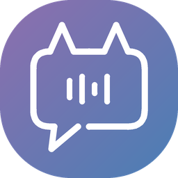

<h1>&nbsp;Soullink・心鏈</h1>

**住在你桌面上的 AI 夥伴**

會陪你聊天、有自己的作息、記得你們的每段對話，關係也會一天一天慢慢改變。

-5a8ad8)

[⬇️ 下載最新版](../../releases/latest)

---

## ✨ 它可以做什麼

| | |
|---|---|
| 🧸 **桌面上的夥伴** | 支援 Live2D、Spine、圖片、GIF。角色會依聊天內容變表情、眨眼、說話時動嘴，想睡時眼睛半開；Spine 小人還會在工作列上散步。 |
| 💬 **會記得你的聊天** | 聊過的事會整理成長期記憶，聊得越久越了解你。支援 SillyTavern 角色卡（V1／V2／V3）和世界書。 |
| 💞 **關係會改變** | 好感度從陌生人一路到摯友、戀人，也可能變成討厭；越熟越難加分。角色會記得你的生日、你們認識的紀念日。 |
| 🌙 **有自己的生活** | 依角色卡安排作息：你離開一陣子回來，他會說剛剛去做了什麼，還會發「動態」，你可以按讚、留言。 |
| 👥 **好幾個角色一起聊** | 本機群聊：每個角色可以用不同的 AI 模型，彼此有關係、有稱呼，會吵架冷戰也會和好；多隻桌寵可以同時出現在桌面上互動。 |
| 🎲 **跑團（CoC 7 版）** | 擲骰建立調查員、AI 守秘人帶團、按鈕擲骰、HP／SAN 狀態欄、劇本結束後寫冒險紀錄；劇本可以拆成給守秘人和給玩家的兩份資料。 |
| 📋 **角色狀態欄** | 自動追蹤劇情裡的數值與狀態（HP、地點、心情、背包…），可以用範本或請 AI 幫你設計整片面板的外觀。 |
| 🔊 **聲音** | 語音輸出：Edge（免費）、Fish Audio、ElevenLabs、OpenAI、Azure、MiniMax，會跟著情緒變語氣；按住快捷鍵說話、本機語音辨識。 |
| 🎨 **外觀** | 五套主題色加自訂顏色、淺色／深色、霧面玻璃；每個角色可以有自己的聊天背景。 |

---

## 🧠 背後的特色系統

不只是把 AI 的回覆貼在桌面上——Soullink 在 AI 之外，自己做了這些系統，讓角色更像「活著」：

<b>💞 好感度與關係階段</b>

- 11 個關係階段：從「死敵、仇人、討厭、不對盤」，到「陌生人」，再到「熟人、朋友、摯友……」一路往上。
- 每句對話結束後，另外請 AI **客觀判斷**這次該加分還是扣分，不是角色自己說了算；越熟越難加分。
- 進入曖昧以上的階段，要雙方分數都到、並在對話裡有一方提出、另一方答應才會升階。
- 好感度會影響桌寵平常的神情、表情強弱和眼神；會記得升階的紀念日。

<b>🌙 作息與動態</b>

- 依角色卡請 AI 排出這個角色的一天，程式照現在的時間判斷「他現在在做什麼」。
- 你離開一段時間回來，程式先挑出他這段時間做了什麼，AI 再改寫成他口吻的動態貼文；離開比較久回來，他會先開口跟你打招呼。
- 想睡的時段，桌寵眼睛會半開、主動搭話的間隔變長。

<b>👥 角色之間的關係</b>

- 群聊裡角色對角色也有好感度，而且有方向（A 怎麼看 B，不一定等於 B 怎麼看 A）。
- 可以設定身分關係：兄弟姊妹、家人、師徒、同事、隊友……和彼此的稱呼。
- 關係變了稱呼會跟著變；吵架會冷戰，生氣的一方要再說幾句、道歉被接受才和好，最多一天自動消氣。
- 房間動態裡角色會互相留言、接話、按讚、吃醋。

<b>🎭 表情與情緒</b>

- 讀 AI 回覆裡的 `*動作描寫*` 判斷情緒（在你電腦上判斷，不另外叫 AI），驅動桌寵表情和語音語氣。
- 表情跟著語音一段一段換，念完才慢慢回到平常的樣子。
- 圖片角色也能有表情包：匯入一組圖片，依檔名對應情緒自動換圖。

<b>🐾 Spine 小人的社交</b>

- 多隻 Spine 小人同時在桌面上時，照群聊內容演出：誰對誰說話就面對面，照動作描寫走過去、追、跑開、並肩坐。
- 閒置時照作息在工作列上散步；感情好的會一起散步、惡作劇、聚在一起，記仇的會互相避開。
- 好感夠高的角色，會走向你停在工作列上的滑鼠。

<b>📋 角色狀態追蹤</b>

- 先請說故事的 AI 在回覆最後附一段看不見的狀態標記；沒有的話程式直接從故事裡讀「HP：8 / 10」這種寫法；都沒有才另外請 AI 分析——能省就省，不多花錢。
- 跑團調查員卡的數值會直接帶進來。
- 角色卡可以自帶整片的狀態面板外觀，放在隔離的框裡執行、不能連網，安全。

<b>🎲 跑團</b>

- 擲骰一律由程式擲，不讓 AI 編數字；AI 守秘人只負責說故事、決定要不要叫你擲。
- 劇本可以請 AI 拆成世界書：守秘人看完整版，一起跑團的 AI 隊友看「玩家公開版」，不會一開始就知道真相。
- 劇本結束後寫冒險紀錄、做技能成長檢定，可以選擇開啟「撕卡」。

---

## 🚀 三步開始

**1. 下載、解壓縮**

到 [Releases](../../releases/latest) 下載 `Soullink-版本-Offline-Windows-x64.zip`，解壓縮到一個資料夾（例如 `D:\Soullink`），打開 `Soullink.exe`。

> 建議不要放在 OneDrive 同步的資料夾裡。

**2. 連上 AI**

在桌寵身上按右鍵 →「一般設定」→ 左邊的「API 連線」，選一家供應商、貼上金鑰、選模型，按「測試連線」看到綠燈就好。

| 供應商 | 適合 |
|---|---|
| OpenRouter | 一個金鑰就能用很多家的模型，最推薦新手 |
| DeepSeek | 便宜、中文好 |
| OpenAI／Gemini | 有帳號的話直接用 |
| Ollama | 在自己電腦跑模型，不用金鑰（需要比較好的電腦） |

**3. 放進你的角色**

- 「人物模型」→ 匯入你的 Live2D／Spine／圖片模型（支援資料夾、zip、rar）。
- 「角色卡」→ 自己寫一張，或匯入 SillyTavern 角色卡，再到角色詳情綁上去。
- 右鍵 →「開啟對話」，開始聊天吧！

> 📦 安裝包裡**沒有附角色模型**，請自己準備，並確認模型的使用授權。

---

## 💾 你的資料

所有資料都存在程式資料夾裡，不會上傳到任何地方：

| 檔案／資料夾 | 內容 |
|---|---|
| `user-settings.json` | 設定、角色、角色卡、群聊紀錄（**含 API 金鑰**） |
| `memories\` | 每個角色的聊天記憶、動態 |
| `models\` | 匯入的模型 |

- 換電腦或重灌前：設定視窗左邊的齒輪分頁 →「備份」，可以選要不要連模型一起備份。
- 🔒 備份檔和整個資料夾裡有你的 API 金鑰，**不要傳給別人**。

---

## 🔄 更新

1. 完全關閉 Soullink（包含右下角系統匣的圖示）。
2. 建議先備份。
3. 把新版的壓縮檔解壓縮到原本的資料夾，覆蓋舊檔。

你的設定、記憶和模型都不會被蓋掉。程式裡「版本」那一格點開，可以看每次更新了什麼。

---

## ❓ 常見問題

<b>會花錢嗎？</b>

Soullink 本身免費。聊天時會用你自己的 API 金鑰呼叫 AI，費用由 AI 供應商向你收取；Edge 語音和 Ollama 不用錢。

<b>回覆很慢？</b>

會先「思考」的模型（例如某些推理模型）比較慢但比較穩；想快一點可以在角色詳情的「AI 連線」幫個別角色換成快速的模型。群聊時角色是一個一個輪流回的，人越多等越久。

<b>桌寵很吃效能？</b>

主要是 Live2D 模型本身的大小。可以調小桌寵、少開幾隻多桌寵；Spine 小人比 Live2D 輕很多。

<b>單機版跟一般版差在哪？</b>

單機版沒有「連線群聊房間」（跟朋友連線一起聊），其他功能都一樣，資料完全只在你的電腦裡。

---

## 📜 授權

本程式**不開放原始碼**，僅提供執行檔免費下載，請勿販售或重新包裝散布。

### 🤖 開發方式

Soullink 由作者企劃、設計和測試，程式碼在 AI 的協助下完成：

- **[Claude Code](https://www.anthropic.com/claude-code)**（Anthropic）
- **[Codex](https://openai.com/codex)**（OpenAI）

每個功能都先討論規格、看過畫面模擬，再由 AI 寫程式、跑測試，作者實際使用後回報問題再修正。

### 🛠️ 感謝這些專案

Soullink 站在這些開源專案和元件的肩膀上，各自依它們的授權使用（部分授權檔附在程式資料夾的 `resources\third-party-licenses`）：

| 專案 | 用在哪裡 | 授權 |
|---|---|---|
| [Electron](https://www.electronjs.org/) | 桌面程式本體 | MIT |
| [PixiJS](https://pixijs.com/)、[@pixi/sound](https://github.com/pixijs/sound) | 畫面繪製、音效 | MIT |
| [untitled-pixi-live2d-engine](https://www.npmjs.com/package/untitled-pixi-live2d-engine)、[easy-live2d](https://www.npmjs.com/package/easy-live2d) | 顯示 Live2D 模型 | MIT／MPL-2.0 |
| [Live2D Cubism Core](https://www.live2d.com/) | Live2D 模型核心 | Live2D 專有授權 |
| [Spine Runtimes](https://esotericsoftware.com/) | 顯示 Spine 模型 | Spine Runtimes License |
| [soullink-emotion-sdk](https://github.com/nanlingyin/soullink-emotion-sdk) | 待機微動、眨眼、呼吸、混合表情 | MIT |
| [whisper.cpp](https://github.com/ggerganov/whisper.cpp)、[nodejs-whisper](https://www.npmjs.com/package/nodejs-whisper) | 本機語音辨識 | MIT |
| [FFmpeg](https://ffmpeg.org/)（[gyan.dev](https://www.gyan.dev/ffmpeg/builds/) 9.0.1 編譯版，[原始碼](https://github.com/FFmpeg/FFmpeg/commit/bf1b838f2a)） | 語音輸入的音檔轉換，以獨立的  執行 | GPL v3 |
| [node-edge-tts](https://www.npmjs.com/package/node-edge-tts) | 免費的 Edge 語音 | MIT |
| [uiohook-napi](https://www.npmjs.com/package/uiohook-napi) | 全域快捷鍵 | MIT |
| [opencc-js](https://www.npmjs.com/package/opencc-js) | 簡體轉繁體 | MIT／Apache-2.0 |
| [fflate](https://www.npmjs.com/package/fflate)、[node-unrar-js](https://www.npmjs.com/package/node-unrar-js) | 備份壓縮、匯入 zip／rar | MIT |
| [Tabler Icons](https://tabler.io/icons) | 介面圖示 | MIT |

使用者匯入的模型、角色卡、聲音等內容，版權屬於原作者。AI 產生的內容不一定正確，請自行判斷。
